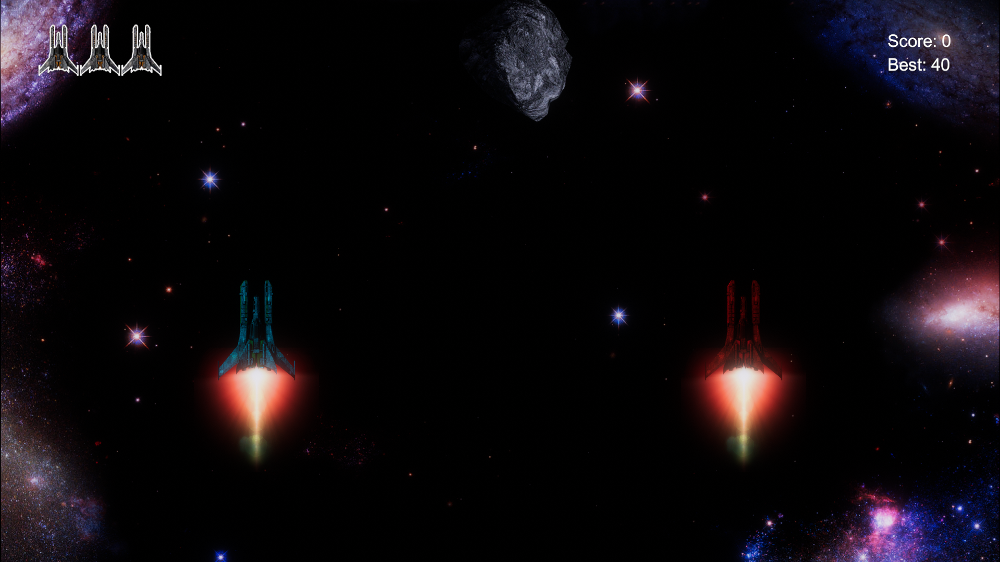
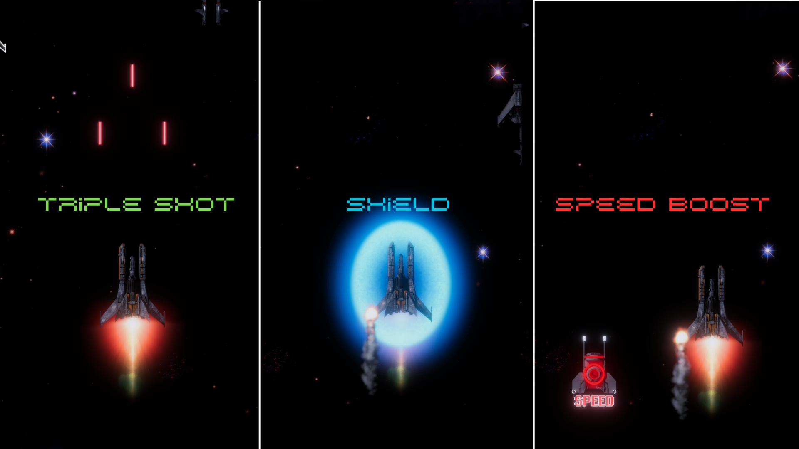

# 🚀 Space Shooter – WebGL Co-op Game

A fast-paced **2D space shooter** built with **Unity** and **C#**, featuring **local co-op multiplayer** and dynamic powerups – all playable directly in your browser!

🌐 **[▶ Play Now](https://tanshetty2409.github.io/space-shooter-webgl/)**

---

## 🎮 Gameplay Features

🧑‍🚀 **Co-op Multiplayer**  
- Two players can play **simultaneously** using the **same keyboard**  
- Perfect for couch gaming fun!

⚡ **Powerups**  
- 🛡️ **Shield** – temporarily protect yourself from damage  
- 🚀 **Speed Boost** – move faster to dodge enemies  
- 🔫 **Triple Shot** – blast three projectiles at once for maximum damage

🎯 **Additional Features**
- Responsive controls and tight movement
- Waves of enemies and endless gameplay potential
- Visual and audio feedback for immersive action

---

## 🛠️ Built With

- [Unity Engine](https://unity.com/)
- C#
- WebGL Build Target
- Hosted via **GitHub Pages**

---

## 📸 Screenshots

|  |  |
|:--:|:--:|
| Co-op Mode | Powerup in Action |

---

## 🚀 How to Run Locally

To play the game locally:

```bash
git clone https://github.com/TanShetty2409/space-shooter-webgl.git
cd space-shooter-webgl
python -m http.server
```


